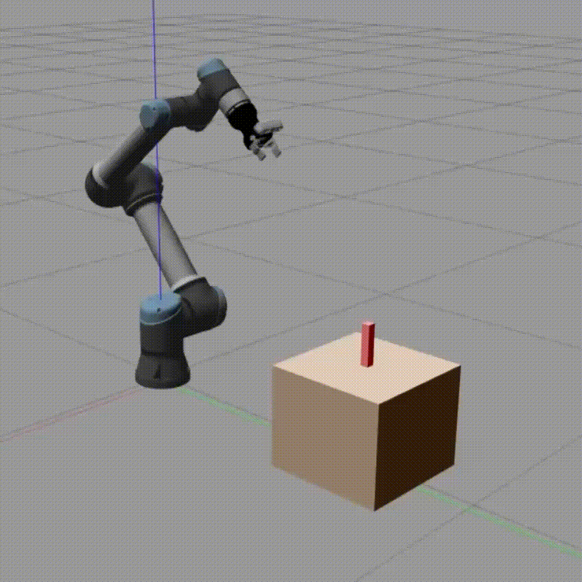

# Grasp and Geometry Detection (ROS)
A complete ROS pipeline for grasp pose generation using GPD and object geometry pose detection via point cloud clustering and bounding box fitting.

## Demo

<table>
  <tr>
    <td align="center">
      <p><strong>Pose Detected by GPD</strong></p>
      
    </td>
    <td align="center">
      <p><strong>UR5e Planning</strong></p>
      
    </td>
  </tr>
</table>

## Setup & Run
### Workspace setup
```bash
# cut the gpd folder to home directory
mv grasp-and-geometry-detection-ros/gpd ~/


# create and build ROS workspace
mkdir -p ~/grasp_ws/src
cp -r grasp-and-geometry-detection-ros/src/* ~/grasp_ws/src/
cd ~/grasp_ws
catkin_make
source devel/setup.bash
```

### GPD
**Requirements:**
* PCL 1.9 or newer
* Eigen 3.0 or newer
* OpenCV 3.4 or newer
* If you have ROS installed, you should be good to go.

**Build the package:**
```bash
cd ~/gpd
mkdir build && cd build
cmake ..
make -j
```